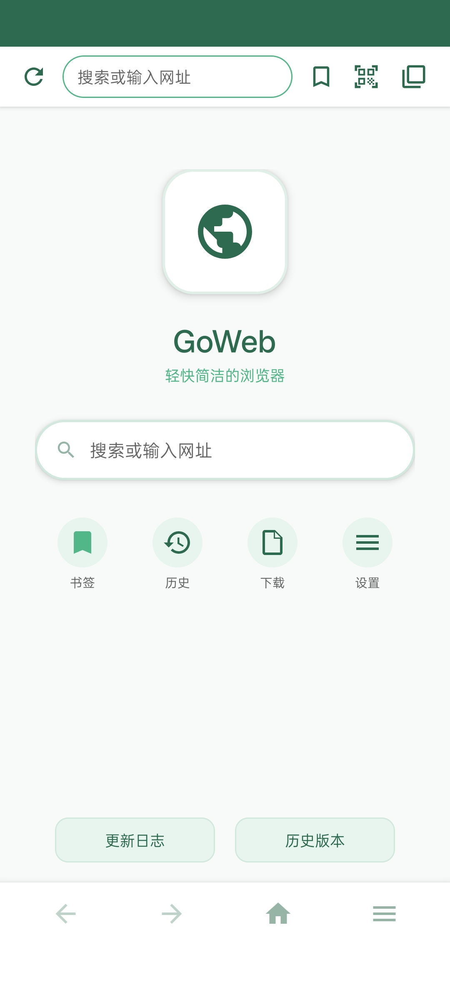
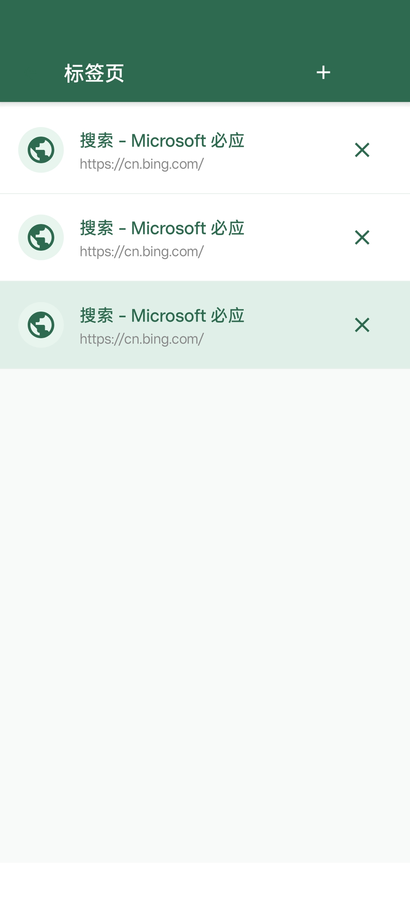
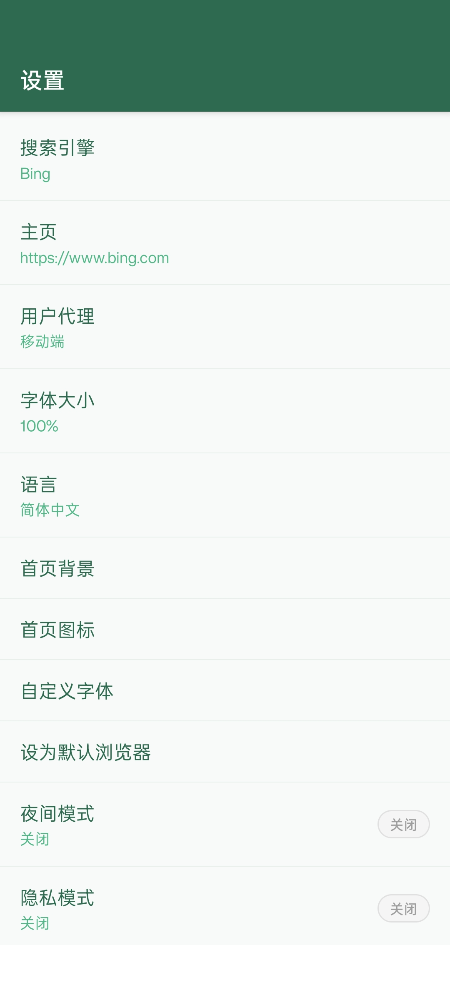
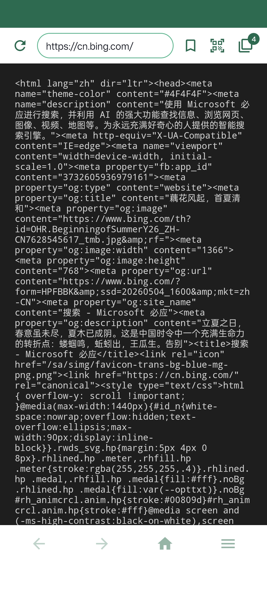

# GoWeb Browser

<p align="center">
  
</p>

<p align="center">
  <b>A lightweight, fast, and privacy-focused Android browser</b>
</p>

<p align="center">
  
  
  
  
</p>

[English](#english) | [中文](#chinese)

---

<a name="english"></a>
## English

### Introduction

GoWeb is a lightweight Android browser developed by the **LCR Team**. Built with pure Java and Android WebView, it delivers a smooth browsing experience while maintaining a tiny footprint (under 1MB). Designed with a green theme (#2d6a4f / #52b788), it offers both aesthetics and functionality.

> **Version**: v1.0.0

### Features

- **Lightweight** - APK size under 1MB, fast startup
- **Multi-tab Browsing** - Independent WebView instances per tab
- **Privacy Protection** - Incognito mode, ad blocking, no tracking
- **Smart Download** - Built-in download manager with progress tracking
- **Offline Reading** - Save web pages for offline access
- **QR Code Scanner** - Built-in QR code scanning for quick URL access
- **Night Mode** - Comfortable browsing in dark environments
- **Page Translation** - One-click translation via Google Translate
- **Customizable** - Multiple search engines, user agent switching
- **Bookmark Management** - Organize your favorite sites
- **History** - Browse and manage your browsing history
- **Find in Page** - Search within web pages
- **View Source** - Inspect page HTML source

### Screenshots

<p align="center">
  
  <br><b>Homepage</b>
</p>

<p align="center">
  
  <br><b>Multi-tab Browsing</b>
</p>

<p align="center">
  
  <br><b>Settings</b>
</p>

<p align="center">
  
  <br><b>View Page Source</b>
</p>

### Download

Download the latest APK from the [Releases](../../releases) page.

### Requirements

- Android 4.4 (API 19) or higher
- No special permissions required for basic browsing

### Build

```bash
# Clone the repository
git clone https://github.com/lcrworld-jtl/GoWeb.git
cd GoWeb

# Build with Gradle
./gradlew assembleRelease
```

### Permissions

- `INTERNET` - Required for web browsing
- `WRITE_EXTERNAL_STORAGE` - For file downloads and offline pages
- `READ_EXTERNAL_STORAGE` - For file uploads
- `CAMERA` - For QR code scanning
- `ACCESS_FINE_LOCATION` - For websites requesting location (optional)

### Architecture

```
GoWeb/
├── core/
│   ├── src/main/java/com/goweb/browser/
│   │   ├── MainActivity.java          # Main browser activity
│   │   ├── webview/
│   │   │   ├── WebViewManager.java    # WebView configuration and callbacks
│   │   │   └── TabManager.java        # Multi-tab management
│   │   ├── ui/
│   │   │   ├── activity/              # Activities (Settings, Bookmarks, etc.)
│   │   │   ├── adapter/               # RecyclerView/ListView adapters
│   │   │   └── dialog/                # Custom dialogs
│   │   └── utils/                     # Utility classes
│   └── src/main/res/                  # Resources (layouts, drawables, values)
└── preview/                           # Website preview
```

### Contributing

We welcome contributions! Please see [CONTRIBUTING.md](CONTRIBUTING.md) for details.

### License

This project is licensed under the MIT License - see the [LICENSE](LICENSE) file for details.

---

<a name="chinese"></a>
## 中文

### 简介

GoWeb 是一款由 **LCR 团队** 开发的轻量级安卓浏览器。使用纯 Java 和 Android WebView 构建，在保持极小体积（不到 1MB）的同时，提供流畅的浏览体验。采用绿色主题（#2d6a4f / #52b788），兼具美观与实用。

> **版本**: v1.0.0

### 功能特性

- **极致轻量** - APK 体积小于 1MB，启动迅速
- **多标签浏览** - 每个标签页独立的 WebView 实例
- **隐私保护** - 无痕模式、广告拦截、无追踪
- **智能下载** - 内置下载管理器，支持进度跟踪
- **离线阅读** - 保存网页供离线访问
- **二维码扫描** - 内置扫码功能，快速访问网址
- **夜间模式** - 暗光环境下舒适浏览
- **网页翻译** - 一键通过谷歌翻译翻译页面
- **高度可定制** - 多搜索引擎、用户代理切换
- **书签管理** - 整理收藏的网站
- **历史记录** - 浏览和管理访问历史
- **页面内查找** - 在网页中搜索内容
- **查看源码** - 查看网页 HTML 源代码

### 截图

<p align="center">
  
  <br><b>浏览器主页</b>
</p>

<p align="center">
  
  <br><b>多标签浏览</b>
</p>

<p align="center">
  
  <br><b>设置页面</b>
</p>

<p align="center">
  
  <br><b>查看网页源代码</b>
</p>

### 下载

从 [Releases](../../releases) 页面下载最新版 APK。

### 系统要求

- Android 4.4 (API 19) 或更高版本
- 基本浏览无需特殊权限

### 编译构建

```bash
# 克隆仓库
git clone https://github.com/yourusername/GoWeb.git
cd GoWeb

# 使用 Gradle 构建
./gradlew assembleRelease
```

### 权限说明

- `INTERNET` - 网页浏览必需
- `WRITE_EXTERNAL_STORAGE` - 文件下载和离线页面保存
- `READ_EXTERNAL_STORAGE` - 文件上传
- `CAMERA` - 二维码扫描
- `ACCESS_FINE_LOCATION` - 网站请求定位（可选）

### 项目架构

```
GoWeb/
├── core/
│   ├── src/main/java/com/goweb/browser/
│   │   ├── MainActivity.java          # 主浏览器界面
│   │   ├── webview/
│   │   │   ├── WebViewManager.java    # WebView 配置和回调
│   │   │   └── TabManager.java        # 多标签管理
│   │   ├── ui/
│   │   │   ├── activity/              # 各功能页面
│   │   │   ├── adapter/               # 列表适配器
│   │   │   └── dialog/                # 自定义弹窗
│   │   └── utils/                     # 工具类
│   └── src/main/res/                  # 资源文件
└── preview/                           # 官网预览
```

### 参与贡献

我们欢迎贡献！请查看 [CONTRIBUTING.md](CONTRIBUTING.md) 了解详情。

### 开源协议

本项目采用 MIT 协议开源 - 详见 [LICENSE](LICENSE) 文件。

---

<p align="center">
  Developed by LCR Team | MIT License
</p>
